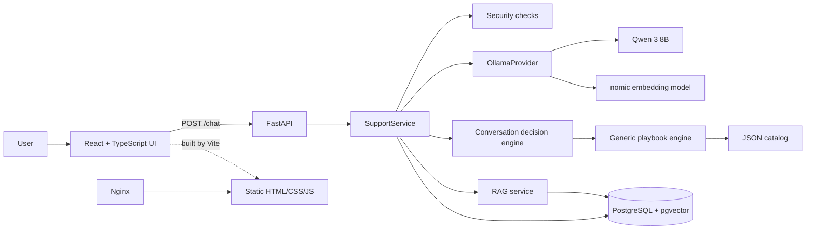

# ResolveDesk

ResolveDesk is a local, AI-assisted first-line IT service desk. It accepts a
problem described in natural language, extracts structured facts, runs a
deterministic troubleshooting workflow, proposes only approved user-safe
actions, and creates a local escalation ticket when the issue cannot be closed
safely at L1.

The project is an academic and portfolio implementation. It demonstrates how a
language model can be used for language understanding without giving the model
control over business workflow or safety decisions.

## Table of contents

- [Project goals](#project-goals)
- [How the application works](#how-the-application-works)
- [Architecture](#architecture)
- [AI and deterministic decision-making](#ai-and-deterministic-decision-making)
- [Implemented features](#implemented-features)
- [Current troubleshooting coverage](#current-troubleshooting-coverage)
- [Technology stack](#technology-stack)
- [Component responsibilities](#component-responsibilities)
- [Project structure](#project-structure)
- [Data model](#data-model)
- [Getting started with Docker Compose](#getting-started-with-docker-compose)
- [Local development](#local-development)
- [Environment variables](#environment-variables)
- [API](#api)
- [Authentication and access modes](#authentication-and-access-modes)
- [Testing](#testing)
- [Extending the troubleshooting catalog](#extending-the-troubleshooting-catalog)
- [Security boundaries](#security-boundaries)
- [Current scope and limitations](#current-scope-and-limitations)
- [Troubleshooting the development environment](#troubleshooting-the-development-environment)

## Project goals

The main goal is to resolve common employee IT issues before they reach an IT
technician while preserving predictable and auditable behavior.

ResolveDesk separates responsibilities as follows:

```text
AI             understands the user's language and extracts facts
Python         controls conversation state and chooses the next transition
Playbooks      define approved L1 questions, conditions, actions, and handoffs
RAG            searches trusted internal knowledge when a playbook is exhausted
PostgreSQL     stores conversations, messages, tickets, and knowledge
```

This separation avoids two unsafe extremes: a large collection of handwritten
conversation branches and an autonomous model that invents support procedures.

The application is designed to:

- understand different descriptions of the same IT problem;
- ask only questions relevant to the current diagnosis;
- retain facts across turns without treating old context as new evidence;
- use one generic rules engine for multiple support domains;
- expose only approved, employee-safe repair steps;
- detect security incidents and physical hazards early;
- search approved knowledge semantically;
- close an incident only after the user explicitly confirms success;
- create a structured local ticket when safe L1 options are exhausted.

## How the application works

A typical request follows this pipeline:

```text
User message
    |
    v
Credential pre-filter and conversation lookup
    |
    v
Qwen structured message analysis
    |
    v
Pydantic schema and evidence validation
    |
    v
ConversationState update in Python
    |
    v
Deterministic decision engine
    |
    +--> ASK: request a missing triage or diagnostic fact
    +--> ACTION: return an approved playbook action
    +--> SEARCH_KB: retrieve trusted knowledge with RAG
    +--> RESOLVED: save the completed resolution
    +--> ESCALATE: create a local IT or Security ticket
```

For example, a user can write:

```text
The printer is on, but it shows Offline and does not print.
```

The language model can classify this as a printing incident and extract the
reported status. The Python engine then selects the `PRINTING` playbook, checks
which facts are still missing, and chooses the next approved question or action.
The model does not decide whether a router may be restarted, whether an account
may be modified, or whether a ticket should be created.

### Conversation lifecycle

Conversations use four persisted stages:

| Stage | Meaning |
| --- | --- |
| `ACTIVE` | Triage and diagnostic facts are being collected. |
| `RESOLUTION` | An approved playbook or Knowledge Base step is being evaluated. |
| `RESOLVED` | The user explicitly confirmed that the original problem is fixed. |
| `ESCALATED` | L1 was exhausted or a safety/security rule required handoff. |

One request produces one deterministic transition. A closed conversation cannot
be continued through `POST /chat`.

## Architecture



The Docker deployment contains three services:

1. `postgres` — PostgreSQL 17 with the pgvector extension;
2. `backend` — FastAPI, the decision engine, and database migrations;
3. `frontend` — a Vite production build served by Nginx.

Ollama runs on the host rather than inside this Compose stack. The backend
container reaches it through `host.docker.internal:11434`.

### Request processing in detail

1. FastAPI authenticates the caller and opens a database transaction.
2. A new conversation is created when `conversation_id` is absent; otherwise the
   existing conversation is loaded and locked for the turn.
3. A deterministic pre-filter detects explicit passwords, OTP codes, API keys,
   and tokens before the message is sent to the model.
4. Qwen returns a structured message analysis: intent, sparse incident facts,
   resolution feedback, and evidence copied from the current message.
5. Pydantic validates field types and enumerations. Backend validation removes
   unsupported facts and requires current-message evidence for accepted facts.
6. A separate diagnostic extraction call maps the message only to facts allowed
   by the selected playbook.
7. Python merges accepted facts into `ConversationState`, calculates impact,
   urgency, and priority when enough information exists, and selects the next
   workflow decision.
8. The response and updated state are committed together. An exception rolls the
   transaction back.

## AI and deterministic decision-making

AI is used in four bounded roles:

| AI operation | Purpose | Backend control |
| --- | --- | --- |
| Message analysis | Classify intent and extract incident facts from natural language. | Structured schema, field allowlist, and exact evidence checks. |
| Diagnostic extraction | Convert a reply into facts from the active playbook. | Only fact names and value types defined by that playbook are accepted. |
| Security assessment | Verify a suspected phishing, malware, credential, MFA, login, loss, or disclosure event. | A non-null event requires evidence from the current message. |
| Knowledge selection | Select one relevant instruction from trusted retrieved sources. | The instruction must be a complete line from the selected source and must pass safety checks. |

The default language model is `qwen3:8b`. The default embedding model is
`nomic-embed-text-v2-moe`. Both are served locally by Ollama and can be changed
through environment variables.

### RAG and trusted knowledge

RAG, or Retrieval-Augmented Generation, is used after applicable playbook actions
are exhausted and the selected workflow permits knowledge lookup.

1. An administrator creates a Knowledge Base article through the API.
2. The embedding model converts its title, content, category, and subcategories
   into a 768-dimensional vector stored by pgvector.
3. The current incident and diagnostic facts are embedded as a search query.
4. PostgreSQL returns semantically similar active articles and technician-verified
   resolved incidents.
5. Qwen may propose one instruction from those sources.
6. Python accepts the proposal only if the instruction is an existing full line
   in the referenced source, has not already been attempted, and does not instruct
   the employee to operate shared network infrastructure.

If no safe and unused instruction is available, the workflow continues toward
triage completion and escalation.

## Implemented features

- Polish-language employee chat interface;
- natural-language incident and self-service intent classification;
- structured fact extraction with evidence from the current message;
- persistent multi-turn conversation state;
- deterministic triage, diagnosis, resolution, and escalation decisions;
- JSON-based generic playbook and action catalog;
- explicit handling of short answers such as yes/no within the active question;
- approved employee-safe L1 actions;
- RAG over active Knowledge Base articles and verified resolved incidents;
- PostgreSQL vector search through pgvector;
- security fast-path for credential exposure, phishing, unexpected MFA,
  suspicious login, malware, lost devices, data disclosure, and unauthorized
  access;
- deterministic credential redaction before persistence, with normal AI
  processing bypassed for matching messages;
- physical-hazard escalation;
- impact, urgency, and P1-P4 priority calculation;
- local escalation tickets with queue, ticket kind, reason code, playbook, and
  catalog version;
- resolved-incident storage and administrator verification for later RAG use;
- optional administrator-only explainability traces;
- optional presentation-only password reset code flow;
- idempotent chat turns when the client supplies a `request_id` UUID;
- owner-scoped conversations and optional bearer-token API access;
- automatic Alembic migration during backend container startup;
- a fresh browser conversation after page refresh or manual closure.

## Current troubleshooting coverage

The current catalog contains specialized playbooks for:

- printers and ordinary printing failures;
- local network, Ethernet, Wi-Fi, and internet access;
- VPN access;
- Outlook;
- account access and forgotten passwords;
- monitors;
- mice;
- keyboards.

It also contains controlled generic workflows for:

- employee-safe device checks;
- specialist and fiscal/label printing handoff;
- application failures;
- system integrations and synchronization;
- payment failures;
- incorrect business data;
- data recovery cases;
- security review.

Service profiles route recognized contexts such as HR, WMS, ERP, POS,
e-commerce, CRM, ATS, electronic signatures, payment terminals, specialist
printers, office scanners, and shared routers to the appropriate playbook and
ticket queue. Coverage means the catalog can collect relevant facts, provide an
approved action where one exists, or escalate safely; it does not imply automatic
repair of every possible product-specific fault.

## Technology stack

### Backend and data

| Technology | Version in the project | Role |
| --- | --- | --- |
| Python | 3.14 container image | Backend language and deterministic workflow logic. |
| FastAPI | 0.141.1 | HTTP API, dependency injection, validation integration, and OpenAPI documentation. |
| Uvicorn | 0.52.4 | ASGI server for FastAPI. |
| Pydantic | 2.13.4 | API contracts, domain models, catalog validation, and structured AI output validation. |
| SQLAlchemy | 2.0.52 | ORM, queries, transactions, and database sessions. |
| Alembic | 1.19.1 | PostgreSQL schema migration. |
| PostgreSQL | 17 (`pgvector/pgvector:pg17`) | Persistent application data. |
| pgvector | 0.5.0 Python package plus DB extension | Embedding columns and cosine-distance search. |
| psycopg | 3.3.4 | PostgreSQL driver. |
| Ollama Python client | 0.6.2 | Local chat and embedding model calls. |
| HTTPX | 0.28.1 | HTTP transport used by the AI provider integration. |
| pytest | 9.1.1 | Backend unit, contract, API, and optional live-AI tests. |

### Frontend and runtime tooling

| Technology | Version in the project | Role |
| --- | --- | --- |
| React | 19.2.x | Component-based chat interface. |
| TypeScript | 6.0.x | Static type checking for frontend code. |
| Vite | 8.2.x | Development server and production frontend build. |
| Node.js | 22 Alpine build image | Frontend dependency installation and build environment. |
| ESLint | 10.x | Frontend static analysis. |
| Nginx | Alpine image | Serves the built static frontend in Docker. |
| Docker Compose | Compose v2 | Starts and coordinates the database, backend, and frontend. |

Vite and Node.js are build-time tools. The production frontend container serves
the generated static files with Nginx; it does not run the Vite development
server.

## Component responsibilities

| Component | Responsibility |
| --- | --- |
| `app/api` | Thin HTTP routes, access checks, request/response models, and dependency wiring. |
| `app/ai` | AI provider protocol, Ollama integration, prompts, time budgets, and structured response validation. |
| `app/models` | Pydantic domain contracts for incidents, conversations, playbooks, tickets, resolution, and explainability. |
| `app/services/support.py` | Orchestrates one complete chat turn. |
| `app/services/conversation.py` | Chooses the next deterministic conversation decision. |
| `app/services/playbook.py` | Loads facts into a generic rules engine and evaluates conditions, questions, actions, and handoffs. |
| `app/services/knowledge.py` | Builds retrieval queries and filters active knowledge. |
| `app/services/resolution.py` | Validates RAG instructions, records attempts, and applies user feedback. |
| `app/services/security.py` | Detects explicit secrets, validates security evidence, and controls the security fast-path. |
| `app/services/priority.py` | Calculates impact, urgency, and priority from collected business context. |
| `app/services/ticket.py` | Builds a structured local escalation ticket and routing metadata. |
| `app/db` | SQLAlchemy tables, sessions, and repository implementations. |
| `app/catalog/actions.json` | Approved end-user action text. |
| `app/catalog/playbooks.json` | Fact schemas, questions, rule conditions, actions, and escalation policies. |
| `app/catalog/policy.json` | Issue-family mapping, service aliases, queue routing, and playbook overrides. |
| `frontend/src/App.tsx` | Chat state, API calls, conversation status, and primary UI rendering. |
| `frontend/src/ExplainabilityPanel.tsx` | Optional trace of accepted facts and backend decisions. |
| `frontend/src/PasswordResetDemo.tsx` | Presentation-only simulated code request and verification UI. |

## Project structure

```text
ResolveDesk/
|-- .env.example
|-- docker-compose.yml
|-- README.md
|-- backend/
|   |-- Dockerfile
|   |-- requirements.txt
|   |-- requirements-dev.txt
|   |-- alembic.ini
|   |-- alembic/
|   |   |-- env.py
|   |   `-- versions/
|   |       `-- e13280f9c6bd_baseline_schema.py
|   |-- app/
|   |   |-- main.py
|   |   |-- ai/
|   |   |-- api/
|   |   |-- catalog/
|   |   |   |-- actions.json
|   |   |   |-- playbooks.json
|   |   |   `-- policy.json
|   |   |-- core/
|   |   |-- db/
|   |   |-- models/
|   |   `-- services/
|   `-- test/
|       |-- conftest.py
|       |-- test_api.py
|       |-- test_contracts.py
|       |-- test_conversations.py
|       `-- test_live_ai.py
`-- frontend/
    |-- Dockerfile
    |-- package.json
    |-- vite.config.ts
    |-- src/
    |   |-- App.tsx
    |   |-- App.css
    |   |-- ExplainabilityPanel.tsx
    |   |-- PasswordResetDemo.tsx
    |   |-- apiErrors.ts
    |   |-- index.css
    |   `-- main.tsx
    `-- tests/
        `-- apiErrors.test.ts
```

## Data model

The baseline Alembic migration enables pgvector and creates six application
tables:

| Table | Stored data |
| --- | --- |
| `conversations` | Owner, stage, incident state, diagnostic state, resolution state, and current question. |
| `messages` | User and assistant messages for a conversation. |
| `tickets` | Escalated incident snapshot, diagnostic facts, attempts, routing, reason, and status. |
| `knowledge_articles` | Trusted content, category metadata, activation state, and a 768-dimensional embedding. |
| `resolved_incidents` | Completed resolutions and optional technician-verified embeddings. |
| `chat_requests` | Idempotency receipt and cached response for a client-provided `request_id`. |

Conversations remain available in PostgreSQL and can be read through the API.
The current browser UI intentionally starts a new in-memory conversation after a
page refresh and does not reload an old conversation automatically.

## Getting started with Docker Compose

### Prerequisites

- Docker Desktop or Docker Engine with Docker Compose v2;
- Ollama installed and running on the host;
- enough local resources to run the selected language model;
- Git only if the project is being cloned from a repository.

Python and Node.js do not need to be installed on the host for the complete
Docker Compose workflow.

### 1. Create the environment file

From the project root:

```bash
cp .env.example .env
```

PowerShell equivalent:

```powershell
Copy-Item .env.example .env
```

`POSTGRES_PASSWORD` is required by Docker Compose. The example value is intended
only for local development and should be changed for any shared environment.

### 2. Download the local AI models

```bash
ollama pull qwen3:8b
ollama pull nomic-embed-text-v2-moe
```

Ensure Ollama is running and listening on port `11434`.

### 3. Build and start the application

```bash
docker compose up --build
```

Compose waits for PostgreSQL, runs `alembic upgrade head`, starts FastAPI, builds
the React frontend with Vite, and serves the result through Nginx.

### 4. Open the services

| Service | URL |
| --- | --- |
| Frontend | http://127.0.0.1:5173 |
| Backend API | http://127.0.0.1:8000 |
| Interactive API documentation | http://127.0.0.1:8000/docs |
| Health check | http://127.0.0.1:8000/health |
| PostgreSQL | `127.0.0.1:5433` |

### Common Compose commands

Start in the background:

```bash
docker compose up -d --build
```

Check service state:

```bash
docker compose ps
```

Follow backend logs:

```bash
docker compose logs -f backend
```

Stop the application without deleting data:

```bash
docker compose down
```

To rebuild only the backend after a Python change:

```bash
docker compose up -d --build backend
```

Do not add `--volumes` to `docker compose down` unless the local PostgreSQL data
may be deleted.

## Local development

This workflow runs PostgreSQL in Docker, Ollama on the host, and the backend and
frontend directly on the host for faster iteration.

### Prerequisites for local development

- Python 3.14;
- Node.js 22 and npm;
- Docker Compose for the pgvector-enabled database;
- Ollama with both configured models.

Create `.env` and pull the models as described in the Docker setup, then start
only PostgreSQL:

```bash
docker compose up -d postgres
```

### Backend

From `backend/`:

```bash
python -m venv .venv
```

Activate the environment on macOS or Linux:

```bash
source .venv/bin/activate
```

Activate it in PowerShell:

```powershell
.\.venv\Scripts\Activate.ps1
```

Install dependencies, migrate the database, and start the API:

```bash
python -m pip install -r requirements-dev.txt
python -m alembic upgrade head
python -m uvicorn app.main:app --reload --host 127.0.0.1 --port 8000
```

The backend loads the root `.env` file automatically. In local mode,
`DATABASE_URL` points to port `5433` and `OLLAMA_HOST` points to
`http://localhost:11434`.

### Frontend

From `frontend/` in a second terminal:

```bash
npm ci
npm run dev
```

Vite serves the development UI at `http://127.0.0.1:5173` and the frontend uses
`http://127.0.0.1:8000` as its default API URL. A different API URL can be
provided to Vite through `VITE_API_URL`.

### Running without Docker

The backend can run without Docker only when a compatible PostgreSQL instance
with the pgvector extension is installed separately. Set `DATABASE_URL` to that
database, run `python -m alembic upgrade head`, and then start Uvicorn. SQLite is
used by parts of the test suite but is not the runtime database for the complete
application.

## Environment variables

The root `.env.example` contains the complete runtime configuration.

| Variable | Example/default | Purpose |
| --- | --- | --- |
| `POSTGRES_DB` | `resolvedesk` | Database name used by Compose. |
| `POSTGRES_USER` | `resolvedesk` | Database user used by Compose. |
| `POSTGRES_PASSWORD` | required | Database password used by Compose. |
| `POSTGRES_PORT` | `5433` | Host port mapped to PostgreSQL. |
| `BACKEND_PORT` | `8000` | Host port mapped to FastAPI. |
| `FRONTEND_PORT` | `5173` | Host port mapped to Nginx. |
| `DATABASE_URL` | `postgresql+psycopg://...@localhost:5433/resolvedesk` | SQLAlchemy URL used when the backend runs locally. Compose overrides it inside the backend container. |
| `OLLAMA_HOST` | `http://localhost:11434` | Ollama URL for a locally running backend. Compose uses `host.docker.internal`. |
| `OLLAMA_MODEL` | `qwen3:8b` | Chat model used for structured language understanding. |
| `OLLAMA_EMBEDDING_MODEL` | `nomic-embed-text-v2-moe` | Embedding model used by RAG. |
| `OLLAMA_THINK` | `true` | Enables the configured model's thinking mode. |
| `AI_CALL_TIMEOUT_SECONDS` | `45` | Maximum duration of one AI provider operation. |
| `AI_TURN_TIMEOUT_SECONDS` | `90` | Total AI time budget for one chat turn. |
| `PASSWORD_RESET_DEMO_ENABLED` | `false` | Enables the presentation-only password reset code flow. |
| `EXPLAINABILITY_TRACE_ENABLED` | `false` | Allows administrator explainability data in chat responses. |
| `RESOLVEDESK_ACCESS_MODE` | `demo` | Selects local demo access or bearer-token API access. |
| `RESOLVEDESK_ACCESS_TOKENS` | `[]` | JSON array of token grants used in `token` mode. |

Feature flags are read by the backend at startup. Recreate or restart the backend
after changing them.

To enable both presentation features locally:

```dotenv
PASSWORD_RESET_DEMO_ENABLED=true
EXPLAINABILITY_TRACE_ENABLED=true
```

## API

FastAPI publishes the complete interactive schema at `/docs`.

### Endpoint summary

| Method | Path | Access | Purpose |
| --- | --- | --- | --- |
| `GET` | `/health` | Public | Process health check. |
| `GET` | `/auth/mode` | Public | Reports whether authentication is required. |
| `GET` | `/auth/me` | Authenticated | Returns the current subject and role. |
| `POST` | `/chat` | Authenticated | Starts or continues a conversation. |
| `GET` | `/conversations/{conversation_id}` | Owner or admin | Returns persisted conversation state and ticket metadata. |
| `GET` | `/conversations/{conversation_id}/messages` | Owner or admin | Returns persisted messages. |
| `POST` | `/knowledge` | Admin | Creates and embeds a Knowledge Base article. |
| `GET` | `/knowledge` | Admin | Lists Knowledge Base articles. |
| `GET` | `/knowledge/{article_id}` | Admin | Returns one Knowledge Base article. |
| `PATCH` | `/knowledge/{article_id}` | Admin | Updates, activates, deactivates, and re-embeds an article when necessary. |
| `GET` | `/tickets` | Admin | Lists local tickets, optionally filtered by status. |
| `GET` | `/tickets/{ticket_id}` | Admin | Returns one local ticket. |
| `PATCH` | `/tickets/{ticket_id}/status` | Admin | Updates ticket status. |
| `GET` | `/resolved-incidents` | Admin | Lists resolved incidents, optionally filtered by verification state. |
| `GET` | `/resolved-incidents/{incident_id}` | Admin | Returns one resolved incident. |
| `PATCH` | `/resolved-incidents/{incident_id}/verify` | Admin | Marks a resolution as technician-verified and creates its embedding. |
| `POST` | `/demo/password-reset/request` | Authenticated, feature-gated | Issues a simulated six-digit code for an eligible conversation. |
| `POST` | `/demo/password-reset/verify` | Authenticated, feature-gated | Verifies and consumes the simulated code. |

### Chat request

Start a new conversation by omitting `conversation_id`:

```bash
curl -X POST http://127.0.0.1:8000/chat \
  -H "Content-Type: application/json" \
  -d '{
    "message": "Nie działa drukarka",
    "include_explainability": false
  }'
```

Continue the returned conversation:

```json
{
  "conversation_id": "returned-conversation-id",
  "message": "Drukarka pokazuje komunikat Paper Jam",
  "request_id": "optional-uuid-for-idempotency",
  "include_explainability": false
}
```

`message` is required, trimmed, and limited to 10,000 characters. A repeated
`request_id` for the same owner and conversation returns the stored response
instead of executing the turn twice.

### Chat response

```json
{
  "conversation_id": "conversation-id",
  "stage": "ACTIVE",
  "incident": {
    "category": "HARDWARE",
    "subcategory": "PRINTING",
    "summary": "Nie działa drukarka",
    "issue_family": "PRINTING",
    "service_profile": null,
    "affected_scope": null,
    "affected_users": null,
    "work_blocked": null,
    "workaround_available": null,
    "workaround_description": null,
    "customer_waiting": null,
    "time_pressure": null,
    "error_message": null,
    "physical_hazard": null,
    "password_forgotten": null,
    "technical_observations": [],
    "impact": null,
    "urgency": null,
    "priority": null,
    "resolved": false
  },
  "reply": "Czy widzisz komunikat lub kod błędu na drukarce? Jeśli nie ma komunikatu, napisz to.",
  "ticket_id": null,
  "password_reset_demo_available": false,
  "explainability": null
}
```

The incident object is returned in full on every chat response, including fields
that are still unknown and therefore set to `null`.

## Authentication and access modes

### Demo mode

`RESOLVEDESK_ACCESS_MODE=demo` is the default. Every request is treated as a
local administrator with subject `local-demo`. This mode is intended for local
development and presentations. The bundled frontend currently assumes this mode.

### Token mode

`RESOLVEDESK_ACCESS_MODE=token` enables bearer-token authentication for API
clients. `RESOLVEDESK_ACCESS_TOKENS` must contain a JSON array of grants with:

- `subject` — conversation owner identifier;
- `role` — `EMPLOYEE` or `ADMIN`;
- `token_sha256` — lowercase SHA-256 digest of the bearer token.

Example structure:

```json
[
  {
    "subject": "employee-1",
    "role": "EMPLOYEE",
    "token_sha256": "64-character-lowercase-sha256-digest"
  }
]
```

The raw token is sent as `Authorization: Bearer <token>` and is not stored in the
configuration. The current frontend does not provide a login or token-entry UI,
so token mode is currently intended for direct API use.

## Testing

### Backend tests without a live model

From `backend/` with the development dependencies installed:

```bash
python -B -m pytest -q -m "not live"
```

These tests cover API behavior, structured AI contracts, playbook and catalog
rules, security boundaries, persistence behavior, and conversation regressions.
Offline tests use a controlled AI implementation and do not require Ollama.

### Live Ollama tests

With Ollama and the configured models running:

```bash
RUN_LIVE_AI=1 python -B -m pytest -q test/test_live_ai.py
```

PowerShell:

```powershell
$env:RUN_LIVE_AI = "1"
python -B -m pytest -q test/test_live_ai.py
```

Live tests exercise the real model and can take longer than unit tests.

### Frontend checks

From `frontend/`:

```bash
npm ci
npm run lint
npm test
npm run build
```

## Extending the troubleshooting catalog

The troubleshooting engine is data-driven. A new device or support domain
usually does not require a new Python controller.

### Catalog files

| File | Defines |
| --- | --- |
| `backend/app/catalog/actions.json` | Reusable, approved instructions that may be shown to an employee. |
| `backend/app/catalog/playbooks.json` | Supported categories, aliases, typed facts, questions, conditions, actions, and escalation rules. |
| `backend/app/catalog/policy.json` | Issue-family defaults, service profiles, queue routing, and profile-specific overrides. |

### Recommended extension process

1. Reuse an existing fact or add a typed fact definition to the relevant
   playbook.
2. Add the exact question used to collect that fact.
3. Add or reuse an approved action from `actions.json`.
4. Express the action or handoff as a playbook rule.
5. Add service aliases or queue routing to `policy.json` only when needed.
6. Add a regression conversation to `backend/test/test_conversations.py`.
7. Run the backend contract and catalog tests.

The catalog is validated at application import. Unknown action references,
unknown facts, invalid value types, duplicate identifiers, cyclic fact
dependencies, and missing questions prevent startup instead of failing during a
user conversation.

## Security boundaries

ResolveDesk is intentionally fail-closed:

- explicit credentials are replaced with a redacted placeholder before storage;
- incident and diagnostic facts require evidence from the current user message;
- AI output must match Pydantic schemas and catalog allowlists;
- security events are re-assessed before the fast-path is activated;
- a problem is closed only after explicit current-message resolution evidence;
- RAG may return only an existing line from an approved source;
- repeated or unapproved knowledge steps are rejected;
- ordinary employees are not instructed to reset or disconnect shared routers,
  switches, access points, network cabinets, or servers;
- physical hazards stop normal troubleshooting and create a handoff;
- responses other than `/health` receive `Cache-Control: no-store`;
- AI provider failures and invalid structured responses produce controlled API
  errors rather than invented fallback instructions.

The presentation password reset flow does not send email or change a real
password. It keeps HMAC digests in process memory, issues a six-digit simulated
code for five minutes, enforces a one-minute resend interval, limits verification
to five attempts, and consumes a successful code once.

## Current scope and limitations

ResolveDesk is a local demonstration of architecture and workflow, not a
production service desk.

- Tickets are stored only in PostgreSQL with `delivery_status=LOCAL_ONLY`.
- There is no Jira, ServiceNow, email, or other external ITSM integration.
- There is no SSO, directory integration, production identity verification, or
  administrator web dashboard.
- Knowledge articles, tickets, and resolved incidents are managed through the
  API and FastAPI documentation rather than the current chat UI.
- The chat UI currently targets the Polish employee experience.
- The browser deliberately starts a new conversation after refresh; persisted
  conversations remain accessible through the API by identifier.
- Ollama is required for normal chat analysis and for creating embeddings.
- RAG quality depends on administrator-provided articles and verified resolved
  incidents.
- The application does not execute commands, remotely control devices, modify
  accounts, restart infrastructure, or change real passwords.
- The security checks are demonstration safeguards and do not replace DLP, SOC,
  endpoint protection, or organizational incident-response procedures.
- The bundled token access mode is an API mechanism, not a complete production
  authentication system.

## Troubleshooting the development environment

### The backend reports `AI_UNAVAILABLE`

Check that Ollama is running and that both models are installed:

```bash
ollama list
docker compose logs --tail 100 backend
```

On slower hardware, increase `AI_CALL_TIMEOUT_SECONDS` and
`AI_TURN_TIMEOUT_SECONDS`, then restart the backend.

### The backend cannot reach Ollama from Docker

The Compose service sets:

```text
OLLAMA_HOST=http://host.docker.internal:11434
```

Confirm that Ollama accepts local requests on port `11434` and that Docker can
resolve `host.docker.internal`.

### Alembic cannot locate a revision

Inspect the database and repository heads:

```bash
docker compose run --rm backend alembic current
docker compose run --rm backend alembic heads
```

The current project uses the baseline revision
`e13280f9c6bd_baseline_schema.py`. Do not delete a revision referenced by an
existing database.

### The frontend build reports a missing module

Install exactly the locked dependencies and rebuild:

```bash
cd frontend
npm ci
npm run build
```

Every import in `src/App.tsx` must have a corresponding source file.

### Resetting all local database data

The following command permanently deletes the Compose PostgreSQL volume:

```bash
docker compose down --volumes
docker compose up --build
```

Use it only when conversations, tickets, Knowledge Base articles, and resolved
incidents are no longer needed.
